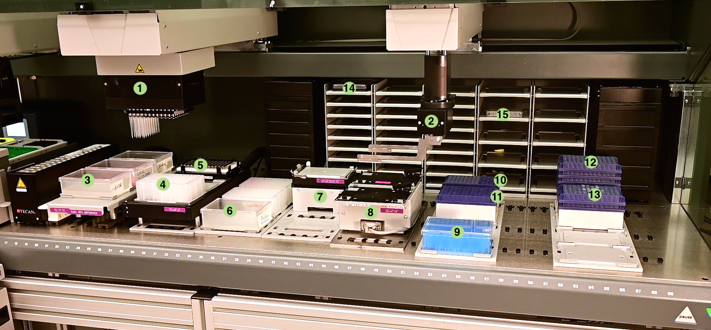

# Automated RNA extraction for SARS-CoV-2 diagnostics

Implemented by Raik Grünberg, Francisco Javier Guzmán & Gerardo Ramos-Mandujano 
King Abdullah University of Science and Technology

The automation script is based on in-house produced magnetic beads. Patient samples are provided in Trizol and are thus completely inactivated -- this makes the workflow safe for a regular biosafety level 1 environment. The script can process between 2 and 12 columns of patient samples (between 16 and 96 samples) at a time.

https://user-images.githubusercontent.com/1862877/219083273-424a2abc-3152-401e-a831-5861e001d930.mp4

(Most scenes sped up, Video edited by Huma Kurrham)

## Robot deck layout

Annotated view of the Tecan Evo200 setup used at KAUST:
(1) MCA (multi-channel pipetting arm), (2) ROMA (plate moving arm), (3) throughs for binding buffer, wash buffer and ethanol, (4) sample processing deepwell plate, (5) magnet, (6) elution buffer and waste plates, (7) heater, (8) shaker, (9) patient sample input, (10) MCA tips source, (11) MCA tips used / destination, (12) clean tip stack, (13) waste tip stack, (14) elution plate, (15) beads plate. 

## Automatted MCA tip handling

Tecan Evoware has built-in tip management for their normal 8-span LiHa tips but does not seem to offer anything comparable for 96-channel MCA tip racks. So we implemented our own automated handling of stacked MCA tips, which may also be useful for other Tecan users. Main features:

* fetch between 2 and 12 columns of tips -- no need to specify positions or stacks
* tips are always fetched from the same (non-stacked) `MCA source` position
* tips are always dropped to the same (non-stacked) `MCA dest` position
* tips and stacks counts are remembered also between runs (stored on disc)
* automatic rotating-in of a new tip rack whenever needed -- no need to hard-code any of it
* startup methods to let user modify or reset tip and stack counts

This is how it looks:

https://user-images.githubusercontent.com/1862877/219094383-5f3ac4c9-0e8b-4bbb-abd5-74414654c334.mp4

Whenever the source position runs out of tips, a new tip rack will automatically be "rotated" in from a source stack and the rack with the used tips is stacked onto a waste stack. The tip handling subroutines can be imported separately from [EvoScripts/subroutines/MCA_tips](EvoScripts/subroutines/MCA_tips). 

Notes:
  - You will have to adapt all subroutine calls in the main script and in several subroutines to the folder where these scripts end up on your system. 
  - The MCA pipetting head needs to be able to pick up partial sets of tips. On our own instrument, we had to remove  plastic clamps protruding right and left of the MCA in order to enable this functionality. Removing the clamps creates a slight risk of the MCA picking up more than one tip stack. Fine-tune the MCA vector definition on the MCA tip rack carrier to prevent that from happening.

